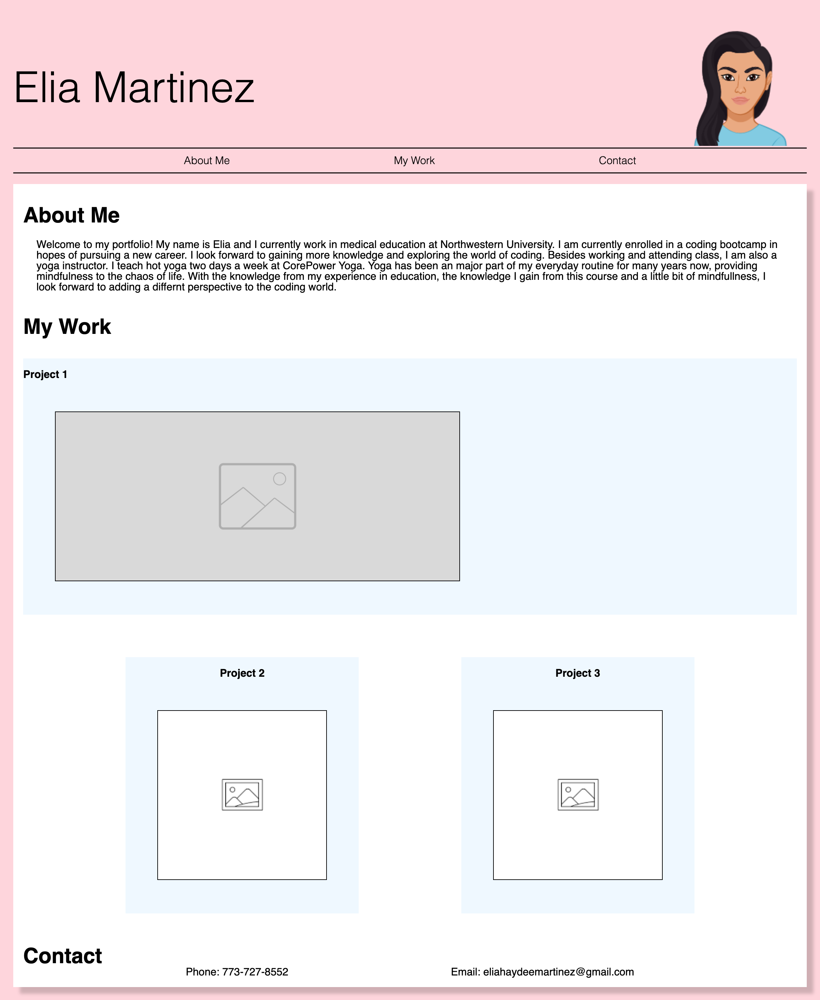

# CssPortfolio

Elia's Css Portfolio

In my portfolio you will find three exmaples of my work to showcase my skills for perspective employers for a job. You will see at the top my name followed by links to an about me section, work, and how to contact me. If you click on each link, you will scroll to that section. If you scrool to "Work" you can see images of the work I have done. At the moment I do not have any examples so I used place holder images. You will see my first example work is larger than the other two. If you click on all three photos of my projects you will be deployed to my github where you can find the repo. I added responsive design for users on mobile phones. A reset page is included. 

Below is a screenshot my portfolio

Here is the URL to my web application: https://eliamart.github.io/CssPortfolio/
