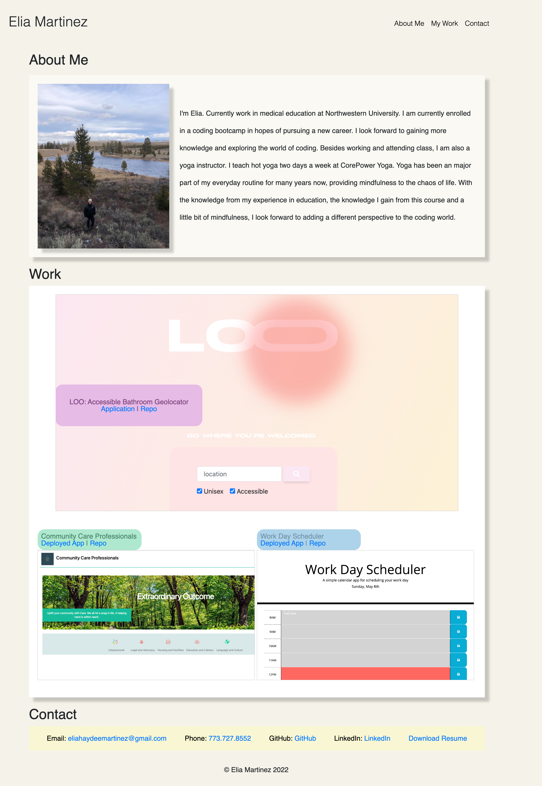

# CssPortfolio

## Description 

In my portfolio you will find three exmaples of my work to showcase my skills for perspective employers for a job. You will see at the top my name followed by links to an about me section, work, and how to contact me. If you click on each link, you will scroll to that section. If you scroll to "Work" you can see images of the work I have done. Clicking on the preoject photos takes you to the  github where you can find the repo and the link to the application.  

## Usage 

Here is the URL to my web application: https://eliamart.github.io/CssPortfolio/
